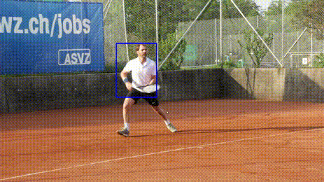
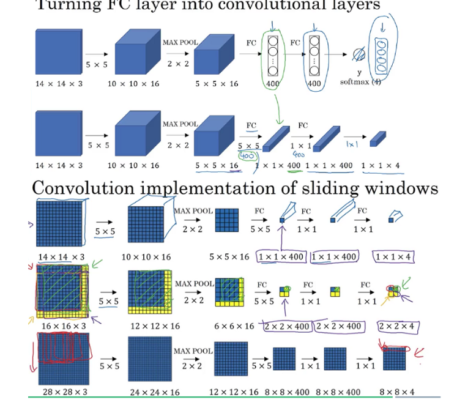

# 
Siamese Dream

## 
A Beginners Guide to Tracking with Siamese Neural Networks

You're sitting on your couch, dog at your feet, one hand completely immersed in a bag of White Cheddar Smartfood. Netflix is on the TV and you're just passing minute 48 of the IMDB rated 6.4/10, thriller Surveillance. You watch as the main character tries to evade the watching eye of the police. Poring over endless frames of CCTV surveillance footage, they follow every move of the antagonist without touching a single button. You cant help but think. They can't actually do this, can they?  The answer to that question is yes, they can. This example depicts one of the many possible applications within the research of the popular scientific discipline of computer vision. A growing area area of research, that has seen an explosion of use cases and promising algorithms. Such algorithms include siamese neural networks, that can implement these as seen on TV results.

Now let this be warning, this article will not make you an over night Elon Musk and you may not come out of with a fully functioning prototype like other articles on this website. What you will have, is an understanding of what these networks are how they achieve such results.

Assumed is a basic knowledge of convolution neural networks and the math behind them. If you don't have that I recommend saving this tab and watching this video, then coming back.
blogPhotos/correlation.gif

[Learn about Convolutional Networks][0f7dd8c6]

[0f7dd8c6]: https://www.youtube.com/watch?v=YRhxdVk_sIs "link"

## Siamese Overview

Let's consider our end goal as taking a video, selecting a target and tracking it throughout the duration. Now lets peer down the rabbit hold and abstract this. First lets think about exactly what video is. Fundamentally it is just a series of photos or images displayed in rapid succession. So all we are trying to do is find a find a target in every frame of a video and draw a box around it. This sounds eerily similar to everyone's favourite children's book _"Where's Waldo"_.

 

Using our eye's and maybe our finger,  we scan the page from left to right looking at every face, shirt or feature to see if it matches that of our old pal Waldo. Maybe even drawing a circle around him just to ruin the game for anyone else that might want to try after.  We want to train an algorithm to do exactly that. Find our target and draw a box around it.

 

Unfortunately we know our network has a bad memory. We must constantly remind it what the target image (waldo) looks like. For this reason, we need two networks. One to process our image of waldo and one for the entire image we are looking for him. This is where the siamese thing comes in. Just like siamese twins. We build two identical fully convolution networks _(we'll get to the fully convolutional thing later_). The twins job is to process our two images (target and search image) and represent distinct features in two separate feature maps. They are attached in that they perform the same job at the exact same time but are distinct in their inputs.

 

The reason they need to be identical is to represent the features that are shared by both images in the exact same way. This is critical when it comes to comparing to see if we have the real waldo. If we are comparing a feature like his shirt. We must ensure we have shared attributes (size, color, pattern). The only way to preserve this is by moving them through an identical network.

The basic idea is that if we can take the representation of our target image (waldo) and place it on top of our search image (the scene). We can find where the most shared features are and this will be the location of our target image(waldo) in the image. We draw a box around it and repeat for all the images until the end of the video! Pat yourself on the back, you just learned the absolute basics of how this works. If you're studying this for an exam or to impress your friends this is probably a good place to stop reading. If you're looking for the nitty gritty details, stay tuned.

At the crux of why this is such an effective way to track video in real time are three concepts that we need to understand. These are transfer learning, fully convolutional networks and correlation filers.
We already know what a convolutional neural network is so lets look at what makes one fully convolutional.

## Fully Convolution Networks
Fully convolutional indicates that the neural network is composed of convolutional layers without any fully-connected layers at the end of the network.

With a fully convolutional implementation the network is learning filters (feature maps) everywhere. Including the final decision making layer.
In a fully connected layer each neuron is connected to every neuron in the previous layer. Each connection has it's own weight. In a convolutional layer each neuron is only connected to a few nearby local neurons in the previous layer, and the same set of weights is used for every neuron.

#### Why do we want to do this?
_**Input Image Size:**_  If you don’t have any fully connected layer in your network, you can apply the network to images of virtually any size. Because only the fully connected layer expects inputs of a certain size. Which is why in architectures like [AlexNet][772ec5d6]
, you must provide input images of a certain size. As most videos and images have varying sizes, this allows us to easily adjust to meet the specifications necessary to process elastically. In this case, using a fully convolutional network makes our implementation more robust.

  [772ec5d6]: https://medium.com/@smallfishbigsea/a-walk-through-of-alexnet-6cbd137a5637 "a"

  _**Computational Cost and Speed**_ : There is also a distinction in terms of compute vs storage between convolutional layers and fully connected layers.
    Do to the nature of being fully connected it eats up far more computation. On the other hand as outline above fully convolutional networks have less connections focusing on "local". This translates perfectly for looking at images where, as required, the features are local (e.g. "waldo's red and white shirt" consist of a set of nearby pixels, not spread all across the image). Having fewer connections makes the fully convolutional network faster and as we are operating in real time this is crucial to effectiveness.

## Transfer Learning
Very generally transfer learning is used when an network does not start learning (adjusting weights and connections) from scratch. Rather it uses pretrained knowledge and builds on top of that. An example I can think of is a mechanic, he may have worked for years at Volkswagen dealership fixing cars. Perhaps he gets a new job fixing school buses. He already knows how to fix vehicles and knows the intricacies of doing so. Although he needs to specialize his skills and learn more to transfer this knowledge to a new type of vehicle. Transfer learning works on the same premise. In our case the first couple layers are pretrained and hold the weights of a large notably successful network [AlexNet](https://mediuAlexNet"m.com/@smallfishbigsea/a-walk-through-of-alexnet-6cbd137a5637). This will offer to give a general representation of the image as outlined above. The remainder of the layers are trained on large datasets such as [GOT-10K](http://got-10k.aitestunion.com/) with predefined bounding boxes and targets. The loss of the function represented by the error of the network(the predicted location in comparison to the ground truth)

      Why do we want to do this?
        -It speeds up network and training!

## Correlation Filters
Alright we are really starting to put the pieces together now. Let's think back to our Where's Waldo analogy. We currently have a a representation of what we are looking for in Waldo (glasses, shirt, hat etc.). All we have to do is compare this to our search image features and see if we can match them up!
 If you did your homework, you remember the operation a convolution neural network performs to create a feature map. How it takes the the filter and performs matrix math operations, moving like a sliding window over the whole image. This produces a new image with accentuated features. In searching for our target we are going to do almost the same thing. Instead of using a generic learned filter we will use our search image's feature map. Passing it over the image block by block, we convolve the image. The output we receive represents the similarity block by block, with higher matching areas receiving a better score. The area of our search image that has the highest similarity is where Waldo is. All we need to do now is draw a box around him and repeat.
 I know what you're thinking that sounds like a lot of stuff to occur in real time. Thankfully we are saved by math. The reason we can do these operations in real time is because it happens in the [fourier domain](https://betterexplained.com/articles/an-interactive-guide-to-the-fourier-transform/). We don't really need to get into exactly why this works right now. Just know that it allows your machine to compute the operations of all these sliding windows simultaneously, in parallel by the multiple cores of your GPU. This allows us to observe the results almost instantaneously.

 

### The Future
Similar to our where's waldo example the problems with our current implementations is that similarity of our background and occlusion cause a problem. I think continued research in this area can be worthwhile. Applications are plentiful and of great importance. Autonomous vehicles, robotics, intelligent tracking and even learned behavior based on tracking in video, all serve as potential fields of specific research.
I highly recommend the paper siamFC: by Luca Bertinetto et al. that provides a great oversight of the area as well as a pretrained demo. It is implemented in Tensorflow and allows you to try it on your own video. A link to the Github repo is right [here](https://github.com/torrvision/siamfc-tf)!
For further reading and more complex approaches not covered here check out [siamRPN](https://github.com/foolwood/DaSiamRPN) and [siamMask](https://github.com/foolwood/SiamMask).
