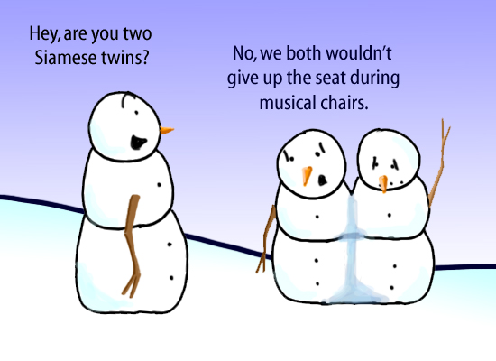

# Siamese Dream
## A Beginners Guide to Tracking with Siamese Neural Networks

You're sitting on your couch, dog at your feet, one hand completely immersed in a bag of white cheddar Smartfood. Netflix is on the box and you're just passing minute 48 of the imdb rated 6.4/10, thriller Surveillance. You watch as the main character tries to evade the watching eye of the police. As they pore over endless frames of CCTV, following every move of the antagonist. You cant help but think. They can't actually do this, can they? The answer to that question is yes, _they_ absolutely can and they will. One way they could do this is using Siamese neural networks.
This article isn't going to make Elon Musk and you may not come out of with a fully functioning prototype but by the end you will understand exactly how these networks are able to achieve such spooky results.
Assumed is a basic knowledge of convolution neural networks and the math behind them. If you don't have that I recommend saving this tab and watching this video, then coming back.
What we need to know

[Learn about Convolutional Networks][0f7dd8c6]

[0f7dd8c6]: https://www.youtube.com/watch?v=YRhxdVk_sIs "link"

## Siamese Overview

As the name suggests the basis of this network is indeed twinned identical fully convolution networks _(we'll get to that_). The twins goal is to create the same representation of the most important features of two distinct images and discern the target from background.

Within the application of video tracking these two images come from two temprally distinct places(ie. different frames) with a only a small distance between them. The basic idea is that if we can take the representation of our first image and correlate it with our 2nd the area with this high correlation will be the new location of the target we want to track. We now take this image and compare it to the next frame and do so until the end of the video. Easy Peasy, you just learned the absolute basics of how this works. If you're studying this for an exam or to impress your friends this is probably a good place to stop reading. If you're looking for the nitty gritty details we're about to get deepkeep scrolling.

How do they do this?

Using a method called [Transfer Learning](https://www.youtube.com/watch?v=yofjFQddwHE) the first couple layers of the network are left static during the training phase. Constructed and weighted to represent the first layers of notable network "alexNet" they will offer to give a general representation of the image as  outlined above. The remainder of the layers are trained on large datasets with predefined  bounding boxes and targets. The loss of the function represented by the error of the network(the predicted location in comparison to the ground truth)

  They are identical in the sense that they share the exact same weights and layers in the network. A unique transfer learning concept both networks have pre-trained
  This concept is not brand new and has many other applications, including hand writing verification ....etc. But it has found a home in being a state of the art approach to tracking in video

### Fully Convolution Networks

### Correlation Filters
Ok, you're smart, you probably already know this but we'll go over it just in case. Remember the operation a convolution neural network performs? How it takes the the filter and performs this matrix math within a sliding box over the whole image to produce another different representation of the same image. This is almost identically the same for correlation filters but instead of transferring one image your making a representation of two images and finding a way to represent their similarities.
You might be thinking, how can this be happening in real time this is a lot of mathematics to be happening to process this in real time.
How do they do this? Welllllllllll

### What Can we do with this in the Future
How this technology can be used has a lot of fruitful applications. Tying
